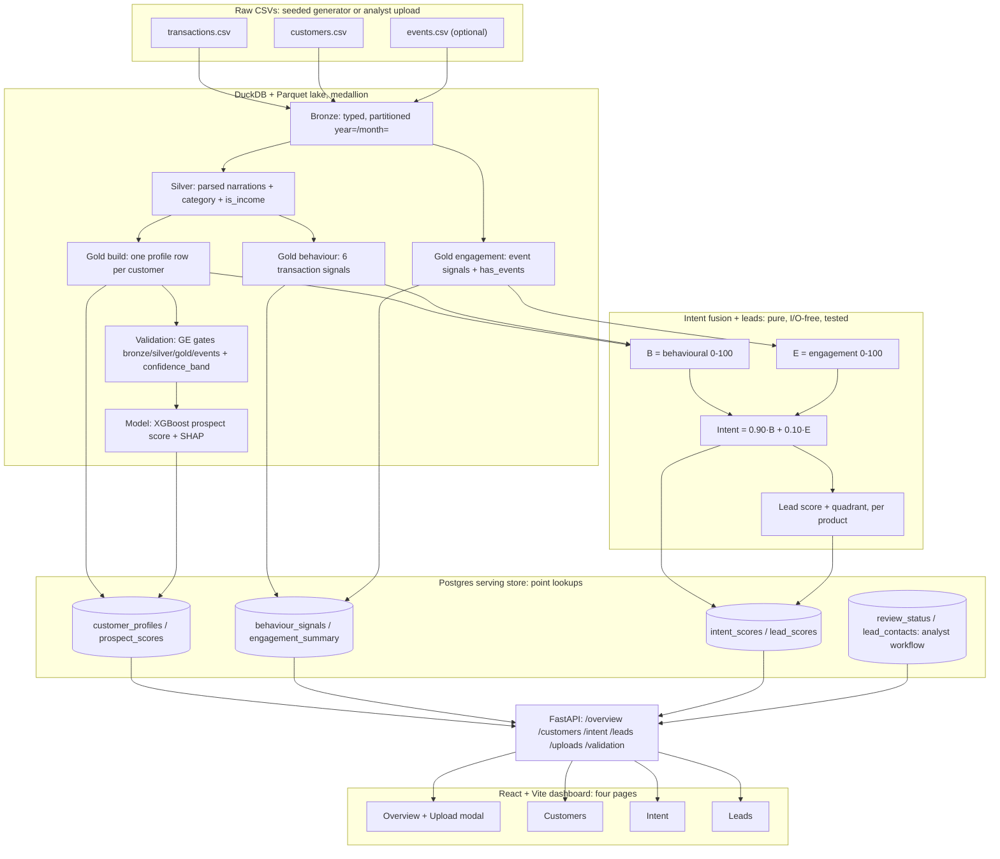

# आय·AI (AayAI)

**आय** ("aay") means income in Hindi.

आय·AI reconstructs a bank customer's **real monthly income** and **investable
surplus** from raw transaction narrations (UPI / NEFT / IMPS / ACH strings),
grades every estimate with a confidence band, scores each customer as an
investment prospect, and then turns all of that into **marketing intelligence**:
a fused purchase-intent score, per-product lead scores, and a ranked, filterable
lead book for analysts.

Everything runs locally and free. No cloud calls, no LLM.

## What it does

**Income intelligence (the pipeline)**

1. **Parses** messy narration strings into channel, counterparty and category.
2. **Reconstructs income**: detects recurring salaries; uses a conservative
   monthly floor for gig workers and merchants (netting out supplier payments).
3. **Computes surplus**: income minus essentials, EMIs and a safety buffer.
4. **Grades trust**: a high / medium / low `confidence_band` per customer from
   history length and parse quality.
5. **Scores prospects**: a small XGBoost model with SHAP reason codes, audited
   to show it does not lean on region.

**Marketing intelligence (built on top)**

6. **Behaviour**: six transaction-only signals per customer (EMI regularity,
   EMI ending, renter, SIP discipline, surplus trend, income growth).
7. **Engagement**: optional marketing **events** (app opens, page views, EMI
   calculator use, enquiries) rolled up into per-customer engagement signals.
8. **Intent fusion**: `intent = 0.90·behavioural + 0.10·engagement`. Events are
   worth **exactly 10%**; a customer with no events degrades cleanly to
   behaviour-only. Every score carries a composition breakdown.
9. **Leads**: scored per customer × product from eligibility gate × intent ×
   prospect score × repayable amount × urgency, labelled into capacity×intent
   quadrants (act-now / nurture / downsell / exclude).

A strict **firewall** keeps ground-truth labels and analyst/app activity out of
every score (see below).

## Architecture


<details>
<summary>Mermaid source (renders interactively on GitHub)</summary>



</details>

Plain-text view of the same flow:

```
data/raw/{transactions,customers,events}.csv     (stage 0: seeded generator)
   |  bronze     typed Parquet, partitioned       aayai.bronze.ingest
   |  silver     parsed narrations + category      aayai.silver.transform
   |  gold       profile / behaviour / engagement  aayai.gold.{build,behaviour,engagement}
   |  gates      GE checks + confidence_band       aayai.validation.run
   |  model      prospect score + SHAP             aayai.model.train
   |  fuse       intent (90/10) + lead scores      aayai.gold.{intent,leads}
   v  serving    Postgres -> FastAPI -> React       aayai.serving.{load,intent_load}, src/aayai/api, frontend/
```

## Stack

| Purpose | Tool |
|---|---|
| Transforms | DuckDB SQL (Athena-compatible where possible) |
| Storage | Parquet, partitioned `year=YYYY/month=MM` |
| Data quality | Great Expectations (bronze, silver, gold, **events** gates) |
| Model | XGBoost + scikit-learn + SHAP |
| Intent / leads | Pure Python (named constants, unit-tested) |
| Orchestration | Airflow (docker-compose, LocalExecutor) |
| Serving | Postgres |
| API | FastAPI (uvicorn) |
| Dashboard | React 19 + Vite + Tailwind + Recharts |

> A legacy read-only Streamlit viewer still lives in `dashboard/`; the React +
> FastAPI app is the primary dashboard.

## The dashboard: one app, four pages

Nav is exactly **Overview · Customers · Intent · Leads**.

- **Overview**: book metrics (incl. an *Act-Now leads* tile), intent-decile
  distribution and quadrant counts, and an **Upload & Analyze** modal (three CSV
  slots for customers, transactions and events, with inline GE gate results and a
  merge confirm).
- **Customers**: searchable book; each profile drills into income
  reconstruction, loan eligibility (via the P/R/N loan-details calculator) and a
  behavioural view.
- **Intent**: per customer, the fused score with a **90% behavioural / 10%
  engagement** composition bar, per-product intent, best-fit and best-repayable
  cards; plus a book view (capacity×intent scatter, decile histogram, cutoff
  slider).
- **Leads**: per-product tabs, ranked table sorted by lead score, quadrant /
  band / source / decile filters, CSV export, and a **mark-contacted** checkbox
  that records workflow state and **changes no score**.

## Quickstart

Prerequisites: **Python 3.12** (Great Expectations does not support 3.14 yet),
**Node 20+** (for the dashboard) and **Docker Desktop** (for Airflow and the
serving database).

```powershell
git clone <repo-url> aayai
cd aayai
py -3.12 -m venv .venv
.venv\Scripts\python -m pip install -r requirements.txt -e .
copy .env.example .env
```

Generate data and run the full pipeline (each step prints a verification
summary):

```powershell
.venv\Scripts\python -m aayai.datagen             # synthetic raw CSVs incl. events (seeded)
.venv\Scripts\python -m aayai.bronze.ingest       # transactions, customers, events
.venv\Scripts\python -m aayai.silver.transform
.venv\Scripts\python -m aayai.gold.build
.venv\Scripts\python -m aayai.gold.behaviour      # transaction behaviour signals
.venv\Scripts\python -m aayai.gold.engagement     # event engagement signals
.venv\Scripts\python -m aayai.validation.run
.venv\Scripts\python -m aayai.model.train
```

Check accuracy against the built-in ground truth:

```powershell
.venv\Scripts\python -m aayai.silver.evaluate     # category accuracy
.venv\Scripts\python -m aayai.gold.evaluate       # income accuracy
```

Run the tests:

```powershell
.venv\Scripts\python -m pytest -q
```

## Dashboard (React + FastAPI)

```powershell
docker compose up -d serving-postgres
.venv\Scripts\python -m aayai.serving.load        # profiles, scores, streams
.venv\Scripts\python -m aayai.serving.intent_load # behaviour, engagement, intent, leads

.venv\Scripts\python -m uvicorn aayai.api.main:app --port 8000    # API
cd frontend; npm install; npm run dev                             # web on :5173
```

Open http://localhost:5173. The API base URL is read from
`frontend/.env.development` (`VITE_API_BASE_URL`, default `http://localhost:8000`).

## Airflow (optional)

```powershell
docker compose build
docker compose up -d
docker compose exec airflow-scheduler airflow dags trigger aayai_pipeline
```

UI at http://localhost:8080 (admin / admin, local dev only). The `aayai_pipeline`
DAG chains bronze through model; a branch skips model training when too little
of the book has a trustworthy confidence band.

## The ground-truth firewall

The synthetic data carries `_`-prefixed answer columns (`_true_category`,
`_is_income`, `_true_monthly_income`, `_is_good_prospect`, and, for events,
`_intent_propensity`) so results can be measured. Strict rules, enforced by SQL
structure and tests:

- No transform, model feature, behaviour/engagement signal or intent/lead score
  ever reads a `_` column.
- Only the two `evaluate` modules read them, to score the pipeline.
- `_is_good_prospect` is used once outside evaluation: as the training label.
- **Analyst/app activity never feeds a score.** Reviews (`review_status`) and
  mark-contacted (`lead_contacts`) live in their own tables and are never read
  by any behaviour, engagement, intent or lead computation.
- Serving reloads never drop those workflow tables.

Swap in real CSVs with the same schema (minus `_` columns) and everything
downstream runs unchanged. Uploaded books carry no ground truth, so accuracy is
never fabricated for them, only reconstructed results.

## Intent fusion: why 10%

`BEHAVIORAL_WEIGHT = 0.90` and `ENGAGEMENT_WEIGHT = 0.10` are named constants
asserted to sum to 1.0 and covered by tests. Bank-statement behaviour is the
strong signal for capacity and product fit; marketing events are a lighter,
noisier nudge, informative but never dominant, and often absent. So intent
leans overwhelmingly on what the money says, with engagement as a 10% tilt, and
degrades to behaviour-only (`engagement_used = false`) when a customer has no
events. Every score returns its composition so the split is always visible.

## Results (seed 42: 200 customers, 18 months, 84,818 transactions, 840 events)

| Measure | Result |
|---|---|
| Category accuracy (silver) | 100% on synthetic narrations* |
| Income reconstruction (gold) | Pearson r 0.954, MAE Rs 9,285, never overstates |
| Prospect model (holdout) | ROC-AUC 0.936 against a label with 4% noise |
| Fairness | region adds no AUC; under 2% of SHAP mass |
| Engagement coverage | 130 / 200 customers have events (rest behaviour-only) |
| Intent fusion | events weight exactly 10%, unit-tested |

*The rule set and the generator share a grammar, so treat 100% as an upper
bound; `parse_confidence` exists to route weak parses on real data.

## Repository layout

```
airflow/dags/    aayai_pipeline DAG
frontend/        React + Vite dashboard (Overview, Customers, Intent, Leads)
dashboard/       legacy Streamlit viewer
data/            raw / bronze / silver / gold   (generated, not tracked)
model/           trained model + reports        (generated, not tracked)
sql/             all DuckDB transform SQL
src/aayai/
  bronze silver gold        medallion transforms (gold: build, behaviour,
                            engagement, intent, leads, loan_products, loan_calc)
  validation                Great Expectations gates + static catalog
  model                     XGBoost training + SHAP
  uploads                   gated analyst CSV ingestion (isolated batches)
  serving                   Postgres load, intent_load, read queries, workflow
  api                       FastAPI routers (overview, customers, intent, leads,
                            uploads, validation, loan-calc, pipeline)
  datagen.py                synthetic raw data generator (seeded, deterministic)
tests/           pure-function + store-backed tests, one area per file
```
